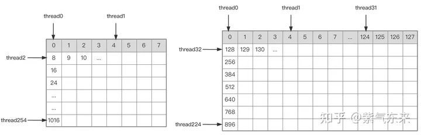
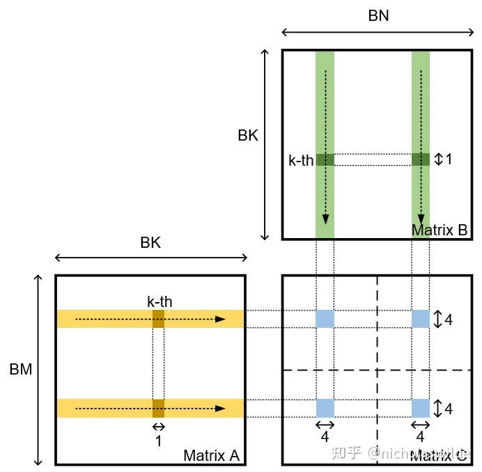

Sgemm，单精度矩阵乘法

## Sgemm naive
* 朴素的矩阵乘法，没有任何优化版本

## Sgemm v1
* 共享内存进行优化gemm，提高计算访存比，计算量 2 * M * N * K，访存量 (BM + BN) * BK * (K / BK) * 4Byte
* output direct 即 gather 模式进行算法的设计
* 线程块大小为 BM * BN，每个线程处理 TM * TN 个元素的结果，共享内存大小为 BK，按照 BM * BK 以及 BN * BK 的大小分别从矩阵 A B 读取
* 具体设置 BM = BM = 128，BK = TM = TN = 8，一个 block 有 BM * BN / (TM * TN) 个线程，每个线程从 A 和 B 的分块矩阵中读取 4 个元素，可以用 float4 读取
* 线程可以按照下图规律确定读取的行、列

## Sgemm v2
* 共享内存若是以 128 字节 (float4) 读取，则分为四个phase，只用考虑每个phase之间是否存在 bank conflict 即可
* A 矩阵是按列来取，存在严重 bank conflict，B 矩阵由于每个线程取 8 个数，存在间隔也会存在 bank conflict，即便用 float4 来读取，也有间隔
* 因此优化方案从两个角度入手：1. A 矩阵进行转置，按列读取也变为按行读取（与 B 矩阵读取方式一样），2. 对每个线程处理的 8*8 大小矩阵分块，分为4个 4 * 4 大小的矩阵，相邻线程使用 float4 读取相邻的地址空间（注意此时只要 0\~7、8\~15、16\~23、24\~31 号线程不存在 bank conflict 就行
* 代码复杂度提升较多

## Sgemm v3
* 使用 double buffer 技巧，原本的任务序列是 “访存1-计算1-访存2-计算2-....-访存n-计算n”，我们将其变为 “访存1  -  计算1&访存2-计算2&访存3-...  -  计算n”，这样能隐藏 load 延迟
* 缺点是会使用双倍的共享内存
