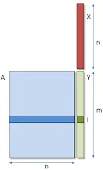

# Sgemv，单精度矩阵向量乘

* 按照 K 为 32 的倍数、K 为 128 的倍数、K = 16 < Warp Size 三种情况来考虑，充分利用 warp reduce 操作，让每个线程尽可能繁忙

* K 为 32 倍数时，一个warp刚好能处理一行，通过读取 A 的一行与 x 做点乘即可，之后通过 warp reduce 进行求和操作

* K 为 128 倍数时，通过向量化访存，一个线程一次读取 float4 的数据

* K 为 16 时，一个 warp 处理两行，但也是通过一个 reduce 操作来进行，区别在于 warp_size 为 16，__shfl_xor_sync 会进行正确规约

* 可以使用 shared memory 进行进一步优化