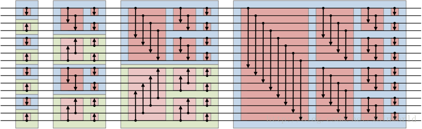
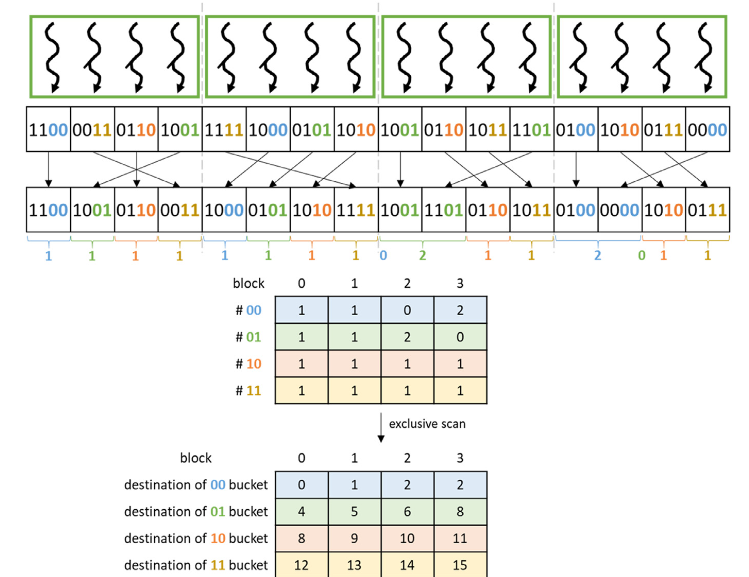
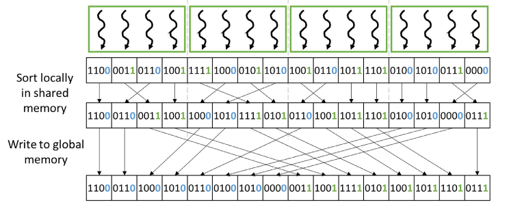
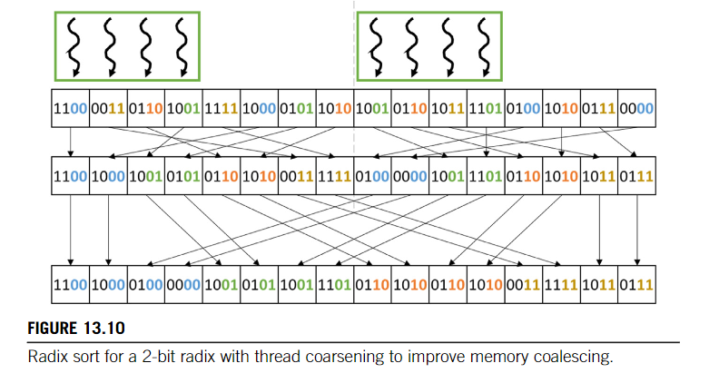

# Bitonic Sort, 双调排序

* 双调序列：循环右移过后能被分为单调的连续两部分的序列称为单调序列，如 1 2 3 4 5 4 2 1

* Batcher定理：对于任意一个双调序列，如果从中间划分，将两边对应数据比大小，小的放左边，大的放右边，最后会得到两个双调序列，并且左边任意一个比右边任意一个小。

* 排序方法：stride 2->N（注意N为2的若干次方），每次以 stride 为单位将序列排为 升序/降序（如果是降序排序，就排为 降序/升序），排序方法根据 Batcher 定理，不断往下划分，每次分为两个序列，最终变为一个序列）。当 stride=N 时，最终数组就排好序了。可以说是一种自底向上又自顶向下的排序方法

* 注意代码实现过程中，通过在 cpu 里面进行循环枚举实现线程块间的同步

* 优点是适合并行计算，缺点是N必须为2的若干次方

# Merge Sort

* 实现了最简单的 merge sort，即使用 cuda 对序列合并进行加速

* 实际上 merge 这部分可以并行优化，假设我们要合并 A B 数组成 C，那么每个线程可以找到其对应的范围（二分法），然后直接根据 index 填入到 C中。进一步可以使用共享内存或者 cycle buffer 来进行数据的缓存。相关实现可以参考 [这里](https://github.com/heyuhhh/Programming-Massively-Parallel-Processors-4th/blob/master/Ch12%20-%20Merge/merge_kernel.cu)

* merge sort 在段数较多的时候适用于并行算法，但段数较少的时候并行效果不明显（没有优化merge的情况下）

* 通过 cpu 中枚举实现线程块间的同步

# Radix Sort

代码实现参考[这里](https://github.com/heyuhhh/Programming-Massively-Parallel-Processors-4th/blob/master/Ch13%20-%20Sorting/sort.cu)

* 核心思路就是根据二进制位逐个进行桶排序，在cpu中枚举从低到高枚举二进制位实现同步

* 确定每个数的bitset之后就要进行排序，这部分可以并行优化，假设 bitset 集合大小为 N，那么有 2^N 个不同的元素，统计每个元素的数量 a，利用 exclusive scan 去找到小于当前元素的个数。然后我们对于各个块，也需要做一遍 exclusive scan 去计算前面块的个数。最后，在当前块内，我们要找到当前元素在第几个。这样确定出 idx 之后就可以直接归位

* 具体实现时，我们需要统计：1. 每个元素的数量；2. 每个块中元素的数量； 3. 当前块的元素数量。

* 为了尽可能合并访存并且好计算上面三个值，我们先对于每个block本地进行一次sort，同时记录1，2，第3点只需要记录 bound_l[val] 就能很快找出。之后对 1，2 进行 exclusive scan。最后进行 global radix sort。本质上就是利用之前的信息去找对应的 idx

* 可以利用共享内存进行缓存，避免重复全局访存，以及通过 thread coarse 等操作

* 基数排序根据二进制位来进行，浮点数也满足位数越高数值越大的性质，所以对于浮点数的情况，将正数的符号位0变为1，负数全部位取反（符号位好理解，其他位越大的实际越小，取反后大的就变小了）

# OddEven Sort

* 可以说是冒泡排序在 gpu 上的优化，一般的冒泡排序需要两重循环，并行性不是很好，但是我们可以通过考虑偶数对交换一次、奇数对交换一次的方法来达到相同的效果

* 所以可以通过 GPU 来并行化不同的相邻对之间的判断

* 由于涉及到全局变量的修改，需要块之间的同步，所以考虑在一个块上进行操作（多个块可能对全局变量的修改有问题）

# Quick Sort

* 使用 cuda 动态并行做了一个简单的示例，实现起来跟 cpu 上的 quick sort 是类似的